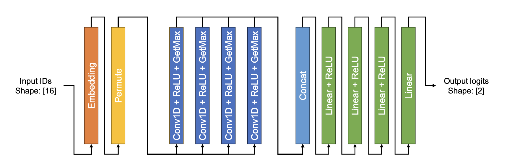

# Parallel Computing for Sentiment Analysis Model
SNU 확장형고성능컴퓨팅 Final Project

## Model Structure

## GPU Information
- Name: NVIDIA TITAN RTX   
- CUDA Runtime Version: 11.8
- Compute Capability: 7.5
- Total number of SMs: 72   
- Max threads per block: 1024 (Less than 1024)   
- Max threads per multiprocessor: 1024
- Threads per warp: 32
- Max regs per block: 65536
- Max regs per multiprocessor: 65536
- Total global mem: 24220 MB
- Max shared mem per block: 48 KB
- Shared mem per multiprocessor: 64 KB
- Max warps per multiprocessor: 32

## Performance Experiments
|ID|Kernel Optimization|Communication Optimization|Throughput(sentences/sec)|Commit Number|
|:-:|:-|:-|:-:|:-:|
|1|Naive Conv1D|Sequential Conv1Ds|686|43562e5|
|2|Conv1D to Input Spread and Matrix WMMA (Tensor core)|Sequential Conv1Ds|4710||
