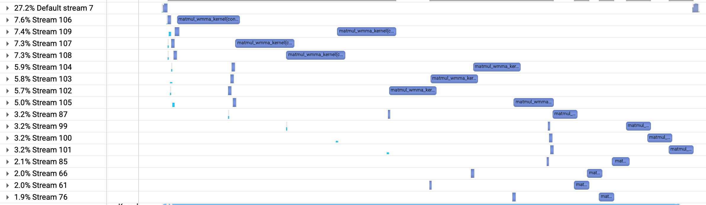

# Parallel Computing and Optimization for Sentiment Analysis Model

## 1. 레이어 연산 구현 및 커널 최적화
모든 레이어 연산은 CUDA Kernel로 구현하였다.   
### Conv1D
- 전체 실행 시간 중 95% 이상을 Conv1D와 관련된 커널 연산 시간이 차지하므로, 성능의 bottleneck이 되는 가장 중요한 레이어이다.
- Naive하게 구현할 경우, 연산의 특성상 스레드 간에 겹치는 메모리 접근이 많다. memory read할 때는 coalesced memory access가 어렵고, memory write할 때는 atomic 연산이 필요하여 비효율적이다. 따라서 im2col에서 사용하는 방식으로 메모리 레이아웃을 변경하여 인풋 데이터를 spread한 후, Matrix Multiplication으로 연산을 수행하도록 Conv1D를 구현하였다.
- `spread_input_kernel`에서 사용하는 Spread 방식은 다음과 같다. 
  - [n, C, s] 형태의 입력(in)을 [n, C * K, os] 형태의 in_spread로 펼친다. (n은 문장의 개수)
  - [OC, C, K] 형태의 파라미터(w)는 그대로 두고, shape만 [OC, C * K]로 해석하면 된다.
  - 이때 각 문장별로 w와 in_spread를 행렬곱하면 [n, OC, os] 형태의 out을 얻을 수 있다. 
  - 아래 예시는 n=1, OC = 2, C=2, S=6, K=3, os=4일 때 입력(in)을 펼친 후 행렬곱으로 바꾸는 과정을 pseudo code로 나타낸 것이다.
  ```
  // Before spread
  w = [
        [[a0, b0, c0],
        [d0, e0, f0]],
        [[a1, b1, c1],
        [d1, e1, f1]]
      ]
  in = [[0, 1, 2, 3, 4, 5],
        [6, 7, 8, 9, 10, 11]]

  // After spread
  w_spread = [[a0, b0, c0, d0, e0, f0],
              [a1, b1, c1, d1, e1, f1]]
  in_spread = [[0, 1, 2, 3],
               [1, 2, 3, 4],
               [2, 3, 4, 5],
               [6, 7, 8, 9],
               [7, 8, 9, 10],
               [8, 9, 10, 11]]

  // Matrix Multiplication
  out = w_spread * in_spread
  ```
- `spread_input_kernel`에서 출력하는 in_spread 행렬의 오른쪽에는 zero padding이 존재한다. 즉, [n, C * K, os] 형태가 아닌 [n, C * K, 16] 형태로 행렬을 만든다. os < 16 이므로 zero padding이 항상 존재한다. 이는 직후 행렬곱을 위해 실행하는 `matmul_wmma_kernel`에서 텐서 코어를 사용할 때 반드시 16 * 16 행렬을 operand로 사용해야 하기 때문이다.
- `matmul_wmma_kernel`은 텐서 코어를 활용하기 위해 WMMA (Warp Matrix Multiplication and Accumulate)를 사용한다. WMMA에서는 16 * 16 크기의 FP16 행렬 2개를 행렬곱하기 때문에, 행렬 a와 b는 half 데이터타입의 배열이다. 16 * 16 크기의 행렬곱 결과를 c_padded에 zero padding이 있는 채로 store하고, zero padding을 제외하여 배열 c로 복사한다. 
- `matmul_wmma_kernel`에서 스레드블록의 크기는 1024(==WMMA_BLOCKDIM) (블록 당 warp 32개)이고, 각 warp가 c_padded에서 16 * 16 블록을 담당하므로, 각 스레드블록이 512(==WMMA_BLOCK_ROWS) * 16 블록을 담당한다. 이때 shared memory 타일링을 적용하기 위해 a는 WMMA_BLOCK_ROWS * WMMA_TSKA 크기의 타일을, b는 WMMA_TSKB * WMMA_N 크기의 타일을 사용하였다. 스레드블록 단위로 동기화하여 shared memory로 타일을 load 후, warp 단위로 wmma 연산을 수행한다. 

### Linear
- 다수의 문장을 batch로 묶어 행렬곱 연산을 수행하였다. 즉 M * K인 행렬 A과 N * K인 행렬 B를 곱할 때 M값이 batch size가 된다. 각각 4개의 GPU를 가진 4개의 노드를 활용하여 16384개의 문장을 한번에 연산하므로, M = 1024가 된다. 
- 연산 결과인 행렬 C에서 TS * TS 크기의 타일을 각 스레드블록이 담당한다. 해당 타일 연산을 위해 A와 B에서 TS * TSK 크기의 타일을 순회하며 shared memory에 로드하였다. 이때 float4로 캐스팅하여 vectorized global memory access를 수행하였다.
- Shared memory load의 오버헤드를 줄이기 위해 각 타일에서 W개의 원소를 하나의 스레드가 담당한다. sums[W][W]에 저장한 연산 결과를 타일 순회가 끝난 뒤 bias와 더하여 C에 복사한다.
- 마지막 linear layer의 경우, N = 2으로 타일 크기보다 훨씬 작으므로 `linear_kernel` 대신 별도의 `linear_narrow_kernel`를 사용하였다. 마찬가지로 shared memory를 이용하여 타일링을 수행하지만, 각 스레드가 C의 하나의 원소만을 담당한다.
### Embedding
- 각 스레드는 아웃풋 원소 1개의 계산을 담당한다. 이를 통해 coalesced global memory access가 가능하다.
### Permute
- 각 스레드가 인풋 원소 1개를 아웃풋 텐서의 적절한 위치로 복사한다.
### ReLU
- 각 스레드가 텐서 원소 1개를 담당하여 element-wise ReLU 연산을 수행한다.
### GetMax
- 각 스레드가 인풋 텐서의 sequence length 개수만큼을 담당하여 max 연산을 수행한다.

<div style="page-break-after: always;"></div>

### Concat
- 각 스레드가 4개 인풋 텐서의 1개 원소씩 담당하여 아웃풋 텐서의 4개 원소로 복사한다.

## 2. Multi GPUs / Multi Nodes 활용
- 16384개의 문장을 4개의 노드가 나눠 연산하기 위해, `predict_sentiment` 실행을 시작하자마자 `inputs`를 MPI_Scatter로 나누고, `predict_sentiment` 실행을 완료하기 전에 `outputs`를 MPI_Gather로 모은다. 각 노드는 4096개의 문장을 처리하게 된다.
- 각 노드에서 `inputs`를 4개 GPU에 분배한다. 각 GPU는 1024개의 문장을 처리하게 된다.
- Performance bottleneck이 되는 Conv1D 연산을 최대한 쪼개어 실행 시간을 단축하려 하였다. 각 GPU 별로 K값(필터 크기)이 다른 Conv1D는 병렬적으로 수행될 수 있기 때문에, 서로 다른 스트림을 사용하여 concurrency를 높이고자 하였다. 이를 위해 Permute 연산 결과를 Device-to-Device memcpy로 복사하였다.
- Pipelining을 활용하여 필터 크기가 다른 Conv1D를 4개로 한번 더 쪼개 kernel launch를 수행하였다.
- 아래 이미지는 NVIDIA Nsight Systems로 확인한 커널들의 타임라인이다. `matmul_wmma_kernel`이 전체 커널 실행의 92.8%를 차지한다.



## 3. 성능 개선 과정
|구현 사항|Throughput(sentences/sec)|
|:-|:-:|
|Naive Conv1D (Single Node, 4 GPUs)|686|
|Conv1D를 Input Spread와 WMMA로 구현|4710|
|행렬 a와 b에 shared memory 타일링 추가|9622|
|4개 노드에 연산 분배|29484|
|shared memory 절약을 위해 c_padded를 shared memory에서 global memory로 변경 후 파라미터 튜닝을 통해 theoretical occupancy를 100%로 개선|36542|
|Conv1D를 파이프라이닝으로 분할|37060 (최종 성능)|

## Further Ideas
- Conv1D 입력의 sample axis를 in_spread의 column에 붙이면 추가적인 최적화가 가능하다. 현재는 zero padding을 추가하여 [n, C * K, 16] 형태의 in_spread를 사용하기 때문에, matrix multiplication할 때 column 크기가 16이기 때문에 타일링에 한계가 있기 때문이다.
- 예를 들어, 16개의 샘플을 column으로 이어붙여 [n/16, C * K, 16 * os] 형태의 in_spread를 만들면 zero padding 없이 텐서 코어를 활용할 수 있다.
- 또한 os = 14, 12, 10, 8인 4개의 Conv1D 연산을 병렬 실행하기 위해, [n/16, C * K, 16 * total_os] (`total_os=14+12+10+8=44`) 형태로 spread하면 더욱 최적화할 수 있다.